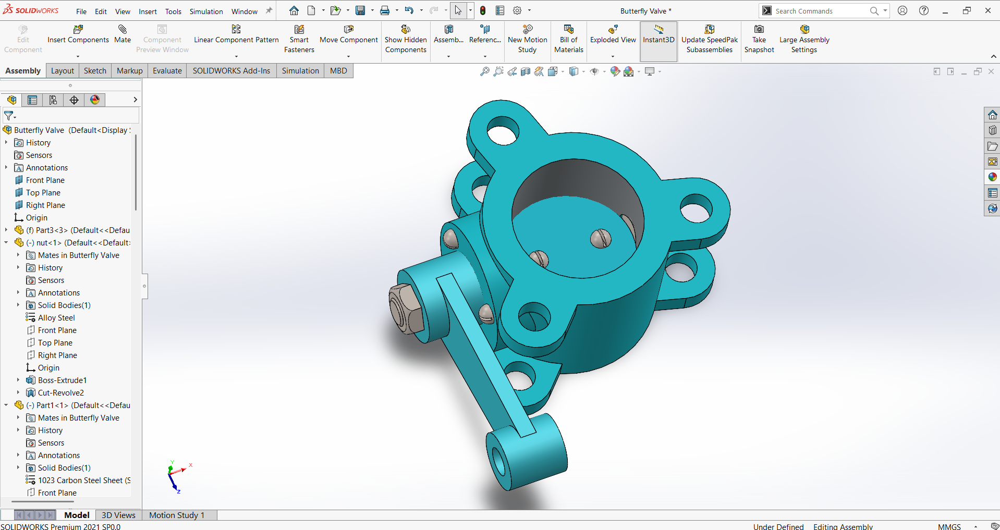
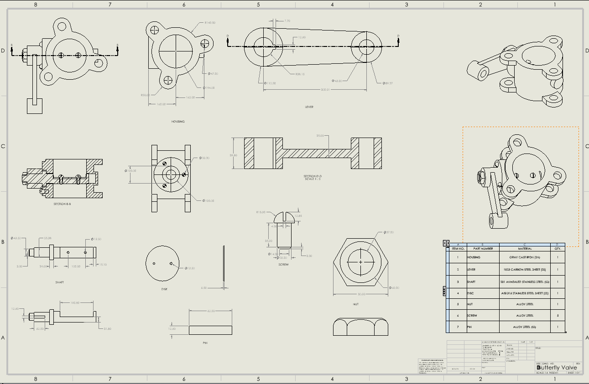

# 🦋 Project 01 – Butterfly Valve Design & Assembly

## 📌 Project Overview

This project demonstrates the complete design and assembly of a Butterfly Valve using **SOLIDWORKS 2021 Premium**.

The objective was to improve my understanding of mechanical product design by developing a complete assembly from individual components, preparing engineering drawings, creating an exploded view, and generating a motion study to visualize the valve's operation.

This project also helped me gain practical experience in engineering documentation and manufacturing-oriented design.

---

# 🎯 Objectives

- Design a complete Butterfly Valve assembly
- Create accurate 3D CAD models of all components
- Generate detailed engineering drawings
- Prepare an exploded assembly view
- Create a motion study demonstrating valve operation
- Apply appropriate engineering materials
- Understand mechanical assembly relationships

---

# 🛠 Software Used

- SOLIDWORKS 2021 Premium

---

# 📦 Components

This assembly consists of the following parts:

| Part | Material |
|------|----------|
| Housing | Cast Iron |
| Valve Disc | Stainless Steel 304 |
| Shaft | Stainless Steel 304 |
| Lever | Mild Steel |
| Pin | Stainless Steel |
| Screw | Alloy Steel |
| Nut | Alloy Steel |

---

# ⚙ Manufacturing Process

| Component | Manufacturing Process |
|------------|----------------------|
| Housing | Sand Casting + Machining |
| Disc | CNC Milling |
| Shaft | CNC Turning |
| Lever | Laser Cutting + Machining |
| Pin | CNC Turning |
| Nut | Cold Forming |
| Screw | Thread Rolling |

---

# 📐 Engineering Features

✔ Parametric CAD Modeling

✔ Mechanical Assembly

✔ Engineering Drawings

✔ Exploded Assembly View

✔ Motion Study

✔ Material Assignment

✔ Bill of Materials (BOM)

✔ Section Views

---

# 📂 Project Files

| File | Description |
|------|-------------|
| Butterfly_Valve_Portfolio.pdf | Complete project documentation |
| Motion_Study.mp4 | Motion Study Animation |
| Engineering_Drawing.png | Manufacturing Drawing |
| Assembly_Render.png | Final Assembly |
| Exploded_View.png | Exploded Assembly |
---

# 🎥 Motion Study

The motion study demonstrates the working mechanism of the Butterfly Valve.

It illustrates:

- Lever rotation
- Shaft movement
- Disc rotation
- Opening and closing mechanism

---

# 📷 Project Gallery

### Final Assembly

---

### Exploded View

---

### Engineering Drawing

(

---

### Motion Study

[📥 Download / Watch Motion Study](Motion_Study.mp4)

---

# 📚 Skills Demonstrated

- Mechanical Design
- CAD Modeling
- Assembly Design
- Engineering Drawing
- Mechanical Documentation
- Material Selection
- Product Design
- Motion Analysis

---

# 💡 Challenges Faced

- Designing proper assembly mates
- Preparing manufacturing-ready engineering drawings
- Creating realistic exploded views
- Developing a smooth motion study
- Selecting suitable engineering materials

---

# 🚀 Future Improvements

This project will be further enhanced by performing:

- Static Structural Analysis
- Stress Analysis
- Factor of Safety Evaluation
- CFD Analysis
- Design Optimization
- Weight Optimization

---

# 📖 Key Learnings

Through this project, I improved my understanding of:

- Mechanical Product Design
- Engineering Documentation
- CAD Best Practices
- Assembly Management
- Motion Simulation
- Design for Manufacturing (DFM)

---

## 👨‍💻 Author

**Govind Goyal**

B.Tech Mechanical Engineering Student

Aspiring Mechanical Design Engineer

LinkedIn:
https://www.linkedin.com/in/govind-goyal-729032242

GitHub:
https://github.com/govindgoyal2025

---

⭐ Thank you for visiting this project. Feedback and suggestions are always welcome.
